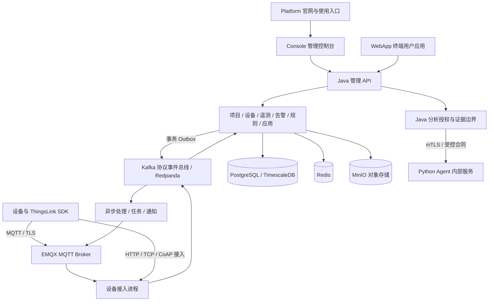

# ThingsLink

**面向企业设备接入、数据处理与业务应用的物联网系统。**

ThingsLink 将设备连接、项目管理、遥测数据、告警、规则、任务、应用发布和运维能力组织在统一的工程体系中。项目包含 Java 后端、管理控制台 Console、终端用户 WebApp、官网 Platform、设备 SDK、Python Agent 和共享客户端合同，支持在自主管理的环境中构建与部署。

系统以租户和项目为业务边界，以设备身份、权限校验和可靠事件处理贯穿数据链路。当前交付范围面向公司内部服务器及来源 IP 白名单环境；具体环境的上线资格由对应构建、集成测试和现场验收结果确定。

## 目录

- [核心能力](#核心能力)
- [系统架构](#系统架构)
- [工程组成](#工程组成)
- [技术栈](#技术栈)
- [快速开始](#快速开始)
- [设备 SDK](#设备-sdk)
- [Agent](#agent)
- [部署与运维](#部署与运维)
- [开发与验证](#开发与验证)
- [开发与维护规范](#开发与维护规范)

## 核心能力

| 领域 | 能力 |
| --- | --- |
| 身份与项目 | 账号、项目、项目成员、角色与权限；租户和项目范围内的数据访问控制 |
| 设备管理 | 设备类型与物模型、设备凭据、属性与事件、命令与回复、设备关系及生命周期管理 |
| 数据处理 | 遥测接入、校验与标准化、属性历史与聚合、原始数据查询、保留策略与导出 |
| 自动化 | 规则执行、定时任务、下行调度、告警触发与恢复、通知投递与回执 |
| 可视化与应用 | 数据看板、组件配置、应用发布、分享访问及面向终端用户的浏览器应用 |
| 项目治理 | 订阅套餐、资源额度、用量计量、超额约束、项目清理、回收与恢复 |
| 集成与固件 | API 密钥、Webhook、实时订阅、对象存储与 OTA 业务管理 |
| 分析辅助 | 设备事实与证据整理、受控分析合同、结构化结果校验和只读报告 |

需要外部通信、公开分享或浏览器会话的能力按配置启用，并执行各自的权限、来源和密钥校验。功能代码、软件联调和硬件验收分别管理，不能用页面可见或编译成功代替完整业务验收。

## 系统架构

后端采用**模块化单体管理服务、独立设备接入进程与异步事件链路**。业务模块围绕领域职责拆分，管理入口负责认证、授权和业务 API；设备接入承担协议边界与上行处理；异步消费者承担规则、通知和后台任务。



图中展示职责与数据流。具体部署可以在开发环境组合运行，也可以将管理与设备接入拆为不同进程；不是每个业务模块都必须独立部署。

### 设计原则

- **业务隔离**：应用层校验租户、项目和资源权限，数据库使用 PostgreSQL RLS 约束数据访问；迁移账号与应用账号分离。
- **明确事务边界**：以 Spring JDBC、显式 SQL 和事务管理实现持久化，跨模块协作通过业务接口及事件合同完成。
- **可靠事件处理**：使用事务 Outbox、幂等处理和消费状态记录衔接数据库与消息总线。重试复用业务身份，处理重复投递及失败恢复。
- **接入与管理分离**：设备协议、Broker 身份与会话、管理 API 和浏览器会话具有独立边界；接入角色不承担管理服务的迁移职责。
- **合同优先**：OpenAPI、版本化客户端合同、生成代码与固定样例共同约束前后端行为，检查接口漂移和运行时输入。
- **受限执行**：规则脚本具有独立执行与资源限制；Agent 使用受控输入、证据引用、预算及内部认证边界。

MQTT PUBACK 表示传输确认，不能代替业务入库确认。消息重投和命令去重也不能一般性保证物理设备动作恰好执行一次。

## 工程组成

### 仓库结构

```text
thingslink/
├── README.md                     # 全工程介绍、构建与运行入口
├── things-link/                   # Java 多模块后端
├── things-link-console/           # 管理控制台
├── things-link-webapp/            # 终端用户浏览器应用
├── things-link-platform/          # 官网与内容页面
├── things-link-device-sdk/        # ESP32 设备 SDK 与工具
├── things-link-agent/             # Python Agent 内部服务与合同
├── things-link-client-contracts/  # 共享客户端合同
├── deploy/                       # 基础设施、配置与部署工具
├── docs/openapi.json              # API 机器合同
├── scripts/                      # 构建、生成及治理检查工具
└── .github/workflows/             # GitHub Actions 验证入口
```

### 各工程职责

| 工程 | 职责 | 主要输出 |
| --- | --- | --- |
| [后端](things-link/) | 业务 API、设备接入、数据处理、权限、规则和后台任务 | Java 可执行 JAR 与领域库 |
| [Console](things-link-console/) | 管理人员工作台；项目、设备、数据、告警、规则及应用配置 | 浏览器静态资源 |
| [WebApp](things-link-webapp/) | 终端用户访问已发布应用；使用受控会话和版本化运行合同 | 浏览器静态资源与宿主候选信息 |
| [Platform](things-link-platform/) | 官网、产品信息与 Markdown 内容页面 | Astro 静态站点 |
| [SDK](things-link-device-sdk/) | ESP32 连接、协议、持久队列、命令台账、配置与设备工具 | SDK 源码、指定板型的设备或探针固件 |
| [Agent](things-link-agent/) | 内部分析输入、结构化结果、证据校验与受控服务边界 | Python 包与内部服务 |
| [客户端合同](things-link-client-contracts/) | Console 与 WebApp 共用的版本化类型、解析及固定基线 | JavaScript、TypeScript 类型声明 |

### 后端模块

`things-link/pom.xml` 为聚合入口，包含 23 个子模块，连同聚合工程共 24 个 Maven reactor 项目。子模块统一使用 `things-link-` 前缀。

| 分组 | 子模块后缀 | 职责 |
| --- | --- | --- |
| 公共基础 | `shared`、`support` | 公共类型、基础设施适配、存储及通用支持 |
| 身份与治理 | `iam`、`project`、`entitlement`、`issuer` | 身份权限、项目、套餐与额度、凭据签发 |
| 设备与数据 | `device`、`telemetry`、`ingestion` | 设备模型、遥测存储与查询、上行接入处理 |
| 自动化 | `alarm`、`task`、`rule` | 告警、任务调度与规则执行 |
| 用户与应用 | `enduser`、`dashboard`、`export` | 终端用户、可视化应用、数据导出 |
| 扩展能力 | `ota`、`integration`、`assistant` | 固件业务、外部集成、分析授权与证据处理 |
| 运行入口 | `runtime`、`bootstrap`、`access` | 运行资源、管理服务与独立设备接入服务 |
| 验证支持 | `simulator`、`testing` | 设备模拟与共享测试基础设施 |

## 技术栈

版本以各工程的构建文件和锁文件为准；下面列出当前声明的主要版本或版本系列。

| 层次 | 技术 |
| --- | --- |
| Java 后端 | Java 21、Spring Boot 4.1.0、Spring JDBC、Spring Security、Flyway、Maven Wrapper |
| 数据与缓存 | PostgreSQL、TimescaleDB、Redis |
| 消息与接入 | Kafka 协议 / Redpanda、EMQX、MQTT、HTTP、TCP、CoAP / DTLS |
| 对象存储 | MinIO 与 S3 兼容对象访问 |
| 规则运行 | GraalVM JavaScript、隔离执行进程与资源预算 |
| Console | Vue 3.5、TypeScript 5.6、Vite 7、Element Plus 2、Pinia 3、Vue Router 4、ECharts 6、Tailwind CSS 4 |
| WebApp | Vue 3.5、TypeScript 5.6、Vite 7、共享客户端合同 |
| Platform | Astro 7、TypeScript 5.6、Tailwind CSS 4、Markdown Content Collections；静态输出 |
| Agent | Python ≥ 3.12、FastAPI 0.142.2、Pydantic 2.13.5、Uvicorn 0.54.0、cryptography 50.0.2、tokenizers 0.23.2 |
| 设备 SDK | C / C++、ESP-IDF 6.1、ESP-MQTT 1.1.0、FreeRTOS、NVS；依赖提交与文件摘要锁定 |
| 验证 | JUnit、Testcontainers、ArchUnit、Vitest、Playwright、pytest、API 与生成合同检查 |
| 运维 | Docker Compose、Nginx 部署模板、Prometheus、Grafana |

Platform 使用 Astro 静态页面，不依赖 Vue 运行时。Agent 的当前依赖与执行模型以 Python 工程为准，业务模型调用需要单独的准入配置。

## 快速开始

### 环境准备

| 工具或输入 | 要求 |
| --- | --- |
| JDK | Java 21；IDE 项目 SDK、Maven 导入和运行 JDK 使用同一版本 |
| Maven | 优先使用后端自带 Wrapper，当前固定 Maven 3.9.16；外部 Maven 需 ≥ 3.9 |
| Node.js | 全工程统一使用 ≥ 22.12.0，以满足官网构建要求 |
| pnpm | 按 `packageManager` 使用 11.9.0；使用冻结锁文件安装 |
| Python / uv | Python ≥ 3.12；Agent 要求 uv 0.12.23 |
| 容器环境 | Docker Engine 或 Docker Desktop，以及 Compose 插件 |
| Shell | Windows 使用 PowerShell；Linux / macOS 工具使用 Bash；部分脚本需要 GNU Make |
| 数据库资源 | 授权取得数据库初始化 SQL 与 Flyway 迁移资源，并恢复到约定目录 |
| 运行配置 | 独立数据库角色、存储密钥、消息服务配置和所需证书 |

**公开代码不包含 SQL 文件和真实凭据。** 首次部署、数据库集成测试与需要数据库的 CI，必须先完成数据库资源的授权获取和目录还原。编译通过不意味着数据库初始化资源已齐备。

### 1. 准备基础设施

从项目根目录运行 Windows 入口：

```powershell
powershell -ExecutionPolicy Bypass -File .\deploy\run-deploy.ps1
```

Linux / macOS 可使用：

```bash
cd deploy
make init
# 编辑本机 .env，配置独立口令、端口及镜像版本
make up
make verify
```

执行前检查 [部署配置示例](deploy/.env.example) 和 [Compose 定义](deploy/docker-compose.yml)。Windows 入口会准备本机配置、启动核心依赖并执行初始化步骤；它不启动 Java 服务或前端工程。必须检查初始化结果和服务健康状态，不能只根据脚本结束判断环境就绪。

### 2. 编译全部后端模块

从项目根目录进入聚合工程：

```powershell
cd things-link
.\mvnw.cmd -DskipTests install
```

Linux / macOS 对应使用 `./mvnw -DskipTests install`。该命令构建并安装全部模块到本机 Maven 仓库，解决独立模块运行时本地依赖尚未安装的问题；`-DskipTests` 不代表测试通过。

配置好数据库和运行环境后，可在 `things-link` 目录启动管理服务：

```powershell
java -jar .\things-link-bootstrap\target\things-link-bootstrap-0.0.1-SNAPSHOT.jar
```

管理服务默认端口为 `8080`。必要配置包括应用数据库连接、Flyway 迁移账号，以及 `THINGS_LINK_STORAGE_ACCESS_KEY`、`THINGS_LINK_STORAGE_SECRET_KEY`。数据库、存储和消息服务的配置必须与本机实际环境一致，不能仅启动容器后直接沿用不匹配的默认值。

在 IntelliJ IDEA 中，打开或导入 `things-link/pom.xml`，取消该 POM 的 Maven 忽略状态，并点击 Maven 工具窗口中的“重新加载所有 Maven 项目”。确认全部模块被识别，再创建以下运行配置：

| 配置 | 主类 | 使用模块 |
| --- | --- | --- |
| 管理服务 | `com.things.link.ThingsLinkApplication` | `things-link-bootstrap` |
| 独立设备接入 | `com.things.link.access.ThingsLinkAccessApplication` | `things-link-access` |

将所需变量填写到运行配置的“环境变量”中。独立接入服务默认使用 `8081`，部署时还需核对接入角色、协议监听、Broker 与消息总线配置。

### 3. 安装并构建前端工程

以下命令均从项目根目录执行。先安装共享合同依赖，再安装各前端工程：

```powershell
pnpm --dir things-link-client-contracts install --frozen-lockfile
pnpm --dir things-link-console install --frozen-lockfile
pnpm --dir things-link-webapp install --frozen-lockfile
pnpm --dir things-link-platform install --frozen-lockfile

pnpm --dir things-link-client-contracts build
pnpm --dir things-link-console build
pnpm --dir things-link-webapp build
pnpm --dir things-link-platform build
```

Console 与 WebApp 的构建入口会检查并构建共享合同。WebApp 构建还会生成宿主候选信息，运行环境中需要可用的 Python；可以通过 `PYTHON` 指定解释器。

分别在独立终端运行需要的开发服务：

```powershell
pnpm --dir things-link-console dev
pnpm --dir things-link-webapp dev
pnpm --dir things-link-platform dev
```

| 工程 | 本地入口 | 配置说明 |
| --- | --- | --- |
| Console | 端口由 `VITE_PORT` 指定，通常为 `3006` | `VITE_API_PROXY_URL` 指向本机管理服务；API 和 WebSocket 通过开发代理接入 |
| WebApp | `http://localhost:3007` | `dev` 先构建，再启动固定端口；业务访问还需要匹配的应用发布及浏览器会话配置 |
| Platform | `http://localhost:4321` | 静态页面开发服务；生产配置与开发配置分别验证 |

## 设备 SDK

[ESP32 工程](things-link-device-sdk/esp32/) 包含协议核心、网络适配、受保护配置、持久化发送队列、命令台账、设备应用及 USB 工具。公共 C++ 命名空间和头文件目录为 `thingslink`。

当前目标构建入口针对 **ESP32-S3 N8R8**，使用固定的 ESP-IDF、ESP-MQTT 提交及 cJSON 文件摘要。根据 [依赖锁文件](things-link-device-sdk/esp32/dependencies.lock.json) 在工程 `.local` 下准备工具链及源码依赖后，在 Bash 环境执行：

```bash
cd things-link-device-sdk/esp32
python3 tools/build_target.py --prepare-dependencies-only
python3 tools/build_target.py --app probe
python3 tools/build_target.py --app device
```

依赖准备只负责下载及核对锁定文件，不执行测试。完整构建会校验工具链提交、源码状态、板型配置和制品摘要；该入口不烧录设备，也不写入 eFuse。

设备应用覆盖 Wi-Fi、MQTT / TLS、属性上报、命令回复及断线恢复。持久队列和命令台账用于保存待确认数据与重复请求结果。真实板卡的网络、存储、保护置备、烧录及负载动作需要分别验收；当前入口不声明 Windows 目标构建资格，也不承诺固件可通刷不同板型。

## Agent

Agent 分为 Java 业务边界与 Python 内部服务。Java 负责身份权限、当前设备事实、证据范围、模型配置和结果访问；Python 负责受控分析输入、预算与结构化结果合同。

内部服务采用 mTLS，证书配置不满足要求时拒绝启动。需要设置 `AGENT_BIND_HOST`、`AGENT_BIND_PORT`、`AGENT_SERVER_CERT`、`AGENT_SERVER_KEY` 和 `AGENT_ALLOWED_CLIENT_CERTS`，其中客户端证书白名单须符合专用证书校验要求。

安装与离线合同验证：

```powershell
cd things-link-agent
uv sync --locked --group test
uv run --locked --group test pytest tests/agent/ -v
```

配置好内部 TLS 后，服务入口为：

```powershell
uv run --locked python -m agent.internal_server
```

离线测试不要求外部模型服务。当前内部健康接口明确返回 `analysisAvailable: false`；启动成功或健康检查通过，不授予业务模型调用资格。业务分析调用需完成独立准入，Agent 不直接获得设备控制权限。

## 部署与运维

### 服务布局

| 部署单元 | 内容与边界 |
| --- | --- |
| 管理服务 | `things-link-bootstrap`；业务 API、身份权限、迁移及后台业务能力 |
| 设备接入 | `things-link-access`；按设备接入角色运行，与管理服务使用独立监听 |
| 浏览器资源 | Console、WebApp、Platform 分别构建；以静态资源部署，配置明确的入口与 API 路由 |
| 核心基础设施 | PostgreSQL / TimescaleDB、Redis、Redpanda、EMQX、MinIO |
| 初始化任务 | 数据库初始化、消息主题准备、对象存储初始化；须检查实际执行结果 |
| 可选运维组件 | Compose `tools` 配置组提供 Redpanda Console、pgAdmin；`obs` 配置组提供 Prometheus、Grafana |
| 内部分析服务 | Python Agent；独立配置内部 TLS 和访问准入 |

[deploy](deploy/) 提供本地 Compose、初始化工具、验证脚本、监控配置以及内部部署模板。默认开发拓扑不能直接作为高可用或容量承诺。

### 生产配置

- 使用独立的数据库、服务账号、数据卷、容器名称及端口；应用账号保持最小权限，迁移角色承担数据库变更。
- 使用生产环境配置和受控密钥注入，替换开发默认密钥及口令；真实凭据、证书私钥与本机 `.env` 不进入 Git。
- 配置 TLS、反向代理、来源 IP 白名单和准确的浏览器来源；公开分享、Webhook、实时连接和应用会话按需启用。
- 配置对象存储的内部与外部地址，校验下载和上传授权；将 Broker、消息服务和数据库管理端口限制在受控网络。
- 分别构建和发布前端资源；WebApp 的宿主候选、摘要及发布合同须与部署资源匹配。

Platform 的生产构建使用 `pnpm --dir things-link-platform build:production`。需预先配置有效的 `SITE_URL`，以及按需配置 `PUBLIC_CONSOLE_URL`；生产校验要求 HTTPS，并拒绝本机与保留示例域名。

### 可观测性与恢复

管理服务配置了健康与 Prometheus 指标入口；[Prometheus 配置](deploy/prometheus/) 和 [Grafana 配置](deploy/grafana/) 用于组织采集与展示。运维应同时关注数据库连接、消息积压、处理延迟、规则失败、通知回执、对象存储及设备会话。

日志关联请求与处理链路，避免记录完整请求体、令牌、设备凭据和模型密钥。备份应覆盖业务数据库、对象文件与必要配置；恢复流程需在隔离环境演练，并验证迁移版本、事件重投和幂等处理。备份存在不能代替恢复可用性验证。

## 开发与验证

### 本地验证入口

| 工程 | 入口 | 前置或范围 |
| --- | --- | --- |
| 后端 | `./mvnw clean verify`；Windows 使用 `.\mvnw.cmd clean verify` | 在 `things-link` 执行；数据库资源、Docker 与集成测试输入齐备 |
| Console | `pnpm --dir things-link-console test`、`api:check`、`build` | 单元测试、API 漂移检查、类型检查与构建；真实后端合同测试另用 `test:contract` |
| WebApp | `pnpm --dir things-link-webapp verify` | 构建、API 合同、单元测试及 Python 工具测试 |
| Platform | `build`、`test:production-config`、`verify:deployment`、`verify:accessibility`、`verify:performance` | 使用 `pnpm --dir things-link-platform <脚本名>`；静态检查基于已构建资源 |
| 客户端合同 | `pnpm --dir things-link-client-contracts verify` | 生成漂移、类型及运行时合同检查 |
| Agent | `uv run --locked --group test pytest tests/agent/ -v` | 在 Agent 目录执行离线合同验证 |
| 基础设施 | `make verify` | 在 `deploy` 执行，基础依赖已启动并完成初始化 |

前端依赖使用 `pnpm-lock.yaml`，Agent 使用 `uv.lock`，SDK 使用摘要锁定的依赖配置。API 机器合同位于 [docs/openapi.json](docs/openapi.json)，合同变化应同时核对生成代码和消费者。

### GitHub Actions

当前保留八项工作流，均由 `workflow_dispatch` 手动触发：

| 工作流 | 职责 |
| --- | --- |
| [backend](.github/workflows/backend.yml) | 后端构建、测试、架构及相关治理检查 |
| [console](.github/workflows/console.yml) | Console 静态检查、单元测试、API 合同与构建 |
| [webapp](.github/workflows/webapp.yml) | WebApp 构建和合同验证 |
| [platform](.github/workflows/platform.yml) | 官网构建、生产配置和静态部署检查 |
| [client-contracts](.github/workflows/client-contracts.yml) | 共享客户端合同验证 |
| [e2e](.github/workflows/e2e.yml) | 浏览器与真实业务链路的端到端验证 |
| [nightly-l1](.github/workflows/nightly-l1.yml) | 设备规模、可靠性及原始证据回归；名称不表示已配置定时触发 |
| [commitlint](.github/workflows/commitlint.yml) | 提交信息约定检查 |

**需要数据库的工作流必须先配置私有 SQL 的授权获取与还原。当前该接入尚未配置，不能将公开仓库检出成功视为全量 CI 输入齐备。**

验证按静态检查、单元与合同、真实依赖集成、端到端、容量与硬件逐层推进。结果须绑定代码候选、环境和实际范围，区分通过、失败、未执行与跳过；本机结果不自动成为远端 CI、正式服务器或硬件的验收结论。

## 开发与维护规范

### 代码风格与测试规范

- Java 生产代码的说明性注释使用中文；Controller 的 HTTP 方法使用中文 JavaDoc，解释用途、参数、返回值及权限等关键边界。
- 保持领域模块职责，避免 Controller 直接串联基础设施细节；公共逻辑通过明确接口复用，不依靠跨模块内部类访问。
- 接口变化同时维护 API 合同、生成代码、调用端与权限断言；客户端共享合同保持框架独立和版本边界。
- 数据库变更使用新迁移，保持版本唯一，避免改写已应用迁移；保留租户隔离、RLS 和迁移角色分离。
- 测试覆盖真实风险与行为：跨租户访问、失效凭据、重复消息、失败恢复、额度约束及边界输入；不得通过整体跳过或关闭安全守卫取得通过结论。

### 配置与交付

提交前检查 `git diff --check`、必要构建与受影响测试。提交信息描述 ThingsLink 本身的功能、修复或工程变化，使用清晰的 Conventional Commits 类型与范围。

本机启动配置、调试工具和验证产物放在 Git 忽略目录；`.local-tools` 用于本地辅助资料，不是产品运行依赖。SQL、真实凭据、依赖缓存、构建结果与日志按仓库隔离规则管理。

对外发布前独立检查内部服务器适配、网络与证书、数据库恢复、容量和设备现场结果。SDK 实机资格、Agent 业务模型准入及公开部署资格以对应验收为准，本 README 不以历史软件验证代替这些结论。
